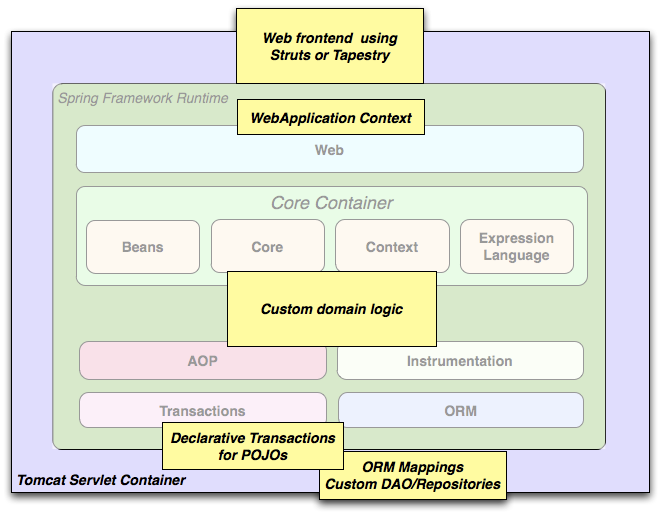
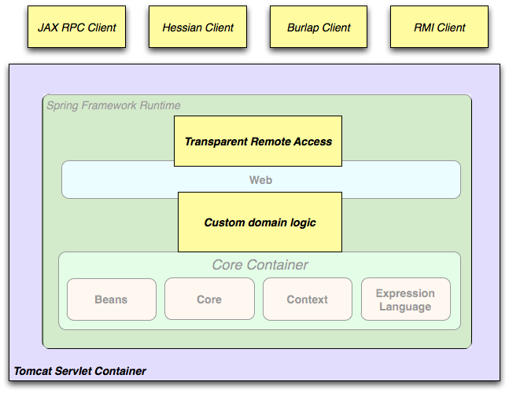
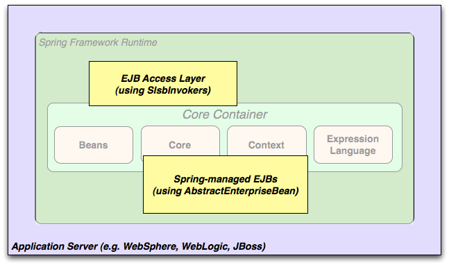

# 关于本翻译

Spring 框架是本人工作至今为止一直使用的框架，该框架确实强大，一直想深入研究一下，因此，利用业余时间翻译了Spring的官方文档。个人认为，想学习一个开源框架的最佳参考资料就是起官方参考文档。由于水平有限，翻译不正确的地方请多指正。如果您觉得还不错，对您有所帮助，不妨打赏哥们一杯咖啡的小费。

---
# 第一部分 Spring框架概述

spring框架为构建企业级应用程序提供了轻量级的解决方案和一站式的开发平台。然而，Spring是模块化的，它允许开发者按需使用所需模块，而无需引入不必要的模块。你可以使用IoC容器,顶层使用其他web框架,但你依然可以仅使用 Hibernate integration code或者 JDBC abstraction layer. Spring框架支持声明式事务管理,也支持通过RMI或者web Service远程访问你的逻辑代码,并且对数据持久化方案也提供了多种选择.Spring提供一个全功能的 MVC framework, 且使你能透明的将 AOP 整合进你的应用程序.
Spring框架是非侵入式的,这意味着你的域逻辑代码通常和框架本身是没依赖的,在你的整合层（比如数据访问层）,会存在一些对数据访问技术和Spring库文件的依赖,但它可以轻易地从你的其它代码中独立出来。
这篇文档是作为Spring框架特性的参考文档.如果对该文档有任何要求,意见或者疑问,请发邮件到到 user mailing list. 如果对框架本身有疑问请前往StackOverflow提问 (见https://spring.io/questions).

## 1.Spring框架入门

本参考指南提供了关于Spring框架的详细信息。它为Spring的所有功能以及Spring所涵盖的基本概念（如“依赖注入”）的背景知识都提供了完整详细的文档。
如果你初次使用Spring，建议您通过创建基于Spring Boot的应用程序来开始使用Spring框架。Spring Boot提供了一种快速的方式来创建一个用于生产环境的Spring应用程序。 它基于Spring框架，遵循约定优于配置的原则，并且旨在尽可能快地让您的应用程序运行。
您可以使用start.spring.io来生成一个spring boot项目，或者参考Spring 官网提供的各个子项目的“入门指南”中的一个，如参考“构建RESTful Web Service入门”一章。 这些入门指南提供的例子都简单易于理解，并且非常重视任务，而且其中大多数例子都是基于Spring Boot开发的。 Spring官网还提供了Spring解决方案中您可能想要考虑的其他项目的参考文档。
## 2.Spring框架简介

　　Spring框架为开发Java应用提供了广泛的基础设施。Spring自己处理基础设施的实现细节，开发者只需专注于自己的应用程序。
Spring框架允许开发者用“简单Java对象”（POJOs）来构建应用程序，并且可以非侵入式地把企业服务应用于POJO。此功能适用于JavaSE的编程模型、全部和部分的javaEE。
　作为一个应用程序开发人员，你可以使用Spring平台的提供各种优势，例如：
　


* 使用Java方法执行数据库事务，而不必处理事务API的细节
* 使本地Java方法作为HTTP请求端点，而无需处理Servlet API的细节。
* 使用本地Java方法执行管理操作，而不必处理JMX API的细节
* 使用本地Java方法进行消息处理，而不必处理JMS API的细节

### 2.1 依赖注入(DI)和控制反转(IOC)

Java应用程序——是一个界定很宽松的术语，其运行范围涵盖了嵌入式应用到n层的大型企业级服务端应用程序，这些应用程序都是典型的由相互合作的对象组成的。因此，一个应用程序中的对象是相互依赖的。
Java平台虽然提供了丰富的应用开发功能，但是它并没有把这些基础构建模块组织成连续的整体，而是把这项任务留给了架构师和开发者。但是你可以使用设计模式，比如工厂模式、抽象工厂模式、建造器模式、装饰者模式以及服务定位器模式等，来构建各种各样的类和对象实例，从而组成完整的应用程序。每个设计模式都根据最佳实践被赋予了形象的名字，通过它们的名字可以很好地描述该模式能干什么、用于什么情形下、解决什么问题，等等，这就使得设计模式简单易用。设计模式是程序开发最佳实践的结晶，所以你应该在你的应用程序中使用它们。
Spring框架的控制反转(IOC)针对上述问题提供了一种标准化的解决方案，即把应用中互相独立的组件组合在一起，从而组成一个完整的可以运行的应用程序。Spring框架的代码遵循设计模式的最佳实践，所以可以直接集成到自己的应用中。因此，大量的组织机构都使用Spring框架来保证自己应用程序的健壮性和可维护性。

> 背景

> 2004年Martin Fowler在他的个人网站上提出了关于控制反转（IoC，Inversion of Control）的概念，“The question is, what aspect of control are [they] inverting?”，后来，他又建议重新命名这个概念，使其可以见名知意，从而提出了依赖注入（DI，Dependency Injection）的概念。

### 2.2 Spring框架的组成模块
Spring框架大约包含了20多个功能模块，这些模块分为Core Container，Data Access/Integration，Web，AOP（面向切面编程），Instrumentation，Messaging和Test，如下图所示。


图2.1 Spring框架概述

下面各部分分别列出了每个模块的可用组件名称及其所涵盖的特性，每个组件都有组件名称，这些组件名称与依赖管理工具中的artifact id是相互对应的。

#### 2.2.1 Core Container(核心容器)

Spring框架的核心容器包括spring-core，spring-beans，spring-context，spring-context-support和spring-expression（SpEL，Spring表达式语言，Spring Expression Language）等模块。
spring-core和spring-beans模块是Spring框架的基础，包括控制反转和依赖注入等功能。BeanFactory是工厂模式的微妙实现，它消除了编程对单例的需要，并且实现配置和依赖与编码逻辑的解耦。
Context(spring-context)模块基于Core and Beans模块提供的实体基础：它提供了一种类似于JNDI注册表的框架式访问对象的方法。 Context模块从Beans模块继承其功能，并增加了对国际化的支持（例如使用Resource Bundles），事件传播，资源加载以及Servlet容器透明地创建上下文。 Context模块还支持Java EE的其他一些功能，如EJB，JMX和基础远程处理。 ApplicationContext接口是Context模块的核心焦点。spring-context-support将常见的第三方库集成到Spring应用程序上下文环境中（例如常见的缓存框架EhCache，Guava，JCache），邮件（JavaMail），任务调度框架（CommonJ，Quartz）和模板引擎（FreeMarker，JasperReports，Velocity）。
spring-expression模块提供了强大的表达式语言，用于在运行时查询和操作对象图。 它是JSP 2.1规范中规定的统一表达语言（统一EL）的扩展。 该语言支持设置和获取属性值，属性分配，方法调用，访问数组，集合和索引器的内容，逻辑和算术运算符，命名变量，以及从Spring的IoC容器中通过名称检索对象。 它还支持列表的投影、选择以及列表聚合。

#### 2.2.2 AOP and Instrumentation

spring-aop模块提供符合AOP联盟标准的面向切面的编程实现，允许自定义方法拦截器和切入点，以便将必须分离的功能的代码与业务逻辑代码干净地解耦（译者注：日志记录代码就是必须分离的功能代码，如果将日志记录代码混在业务逻辑代码里，显得很混乱乱）。 通过使用源码级元数据功能，您还可以将行为信息包含进自己的代码中，这与.NET的属性类似。
spring-aspects模块提供了与AspectJ的集成。
spring-instrument模块提供了对检测类的支持和用于特定的应用服务器的类加载器的实现。spring-instrument-tomcat模块包含了用于Tomcat的Spring检测代理。
#### 2.2.3 Messaging

Spring4.0包含了的spring-message模块是从Spring集成项目的关键抽象中提取出来的，其中包含来自Spring Integration项目（如Message，MessageChannel，MessageHandler等）的关键抽象，以作为基于消息的应用程序的基础。 该模块还包括一组用于将消息映射到方法的注解，类似于基于Spring MVC注解的编程模型。

#### 2.2.4 Data Access/Integration

数据访问与集成层包含JDBC、ORM、OXM、JMS和事务模块。
spring-jdbc模块提供了对JDB的抽象，它消除了冗长的JDBC编码和对数据库供应商特定错误代码的解析。
spring-tx模块支持编程式事务和声明式事务，可用于实现了特定接口的类和所有的POJO对象。
spring-orm模块提供了对流行的对象关系映射API的集成，包括JPA、JDO和Hibernate等。通过此模块可以让这些ORM框架和spring框架的其它功能整合，比如前面提及的事务管理。
spring-oxm模块提供了对OXM实现的支持，比如JAXB、Castor、XML Beans、JiBX、XStream等。
spring-jms模块包含生产（produce）和消费（consume）消息的功能。从Spring 4.1开始，集成了spring-messaging模块。

#### 2.2.5 web

Web层包括spring-web、spring-webmvc、spring-websocket、spring-webmvc-portlet等模块。
spring-web模块提供面向web的基本功能和面向web的应用上下文，比如多部分（multipart）文件上传功能、使用Servlet监听器初始化IoC容器等。它还包括HTTP客户端以及Spring远程调用中与web相关的部分。
spring-webmvc模块（即Web-Servlet模块）为web应用提供了模型视图控制（MVC）和REST Web服务的实现。Spring的MVC框架可以使领域模型代码和web表单完全地分离，且可以与Spring框架的其它所有功能进行集成。
spring-webmvc-portlet模块（即Web-Portlet模块）提供了用于Portlet环境的MVC实现，并反映了spring-webmvc模块的功能。

#### 2.2.6 Test

spring-test模块通过JUnit和TestNG组件支持单元测试和集成测试。它提供了一致性地模拟对象和Spring上下文，也提供了用于单独测试代码的（mock object）。

### 2.3 Spring框架的应用场景
前面介绍的Spring各个功能模块使得Spring框架在很多场景成为一种不二的选择，无论是资源有限的嵌入式应用还是使用了事务管理和web集成框架的成熟的企业级应用。


图2.2 典型的Spring web应用程序架构

Spring的声明式事务管理可以使web应用完成事务化，就像使用EJB容器管理的事务一样。所有由用户定制的业务逻辑都可以使用简单的POJO实现，并用Spring的IoC容器对POJO进行管理。另外，还包括发邮件服务和独立于web层的验证功能，由用户自己在决定何处执行验证规则。Spring的ORM框架可以集成JPA、Hibernate和JDO等，比如，使用Hibernate时，可以继续使用已存在的映射文件和标准的Hibernate的SessionFactory配置。表单控制器把web层和领域模型无缝地整合在一起，移除了ActionForms和其它把HTTP参数转换成领域模型的类。



图2.3 Spring作为中间层整合第三方Web框架

在一些场景下，可能不允许你完全切换到另一个框架。然而，Spring框架不强制你使用它所有的东西，它不是非此即彼（all-or-nothing）的解决方案。前端使用Struts、Tapestry、JSF或别的UI框架时都可以把Spring作为中间层进行集成，从而使用Spring的事务管理功能。开发者仅仅只需要使用ApplicationContext来封装自己的业务逻辑，并使用WebApplicationContext集成web层即可。



图2.4 Spring框架的远程调用场景

当需要通过webservice访问现有代码时，可以使用Spring的Hessian-，Burlap-，Rmi-或者JaxRpcProxyFactory类。Spring框架使得远程访问现有的应用并非难事。



图2.5 EJBs-封装现有的POJOs

Spring框架也为EJB提供了抽象访问层，可以重新使用现有的POJO并把它们包装到无状态的会话Bean中，使其应用于可扩展的安全的web应用中。

#### 2.3.1 依赖管理和命名约定
依赖管理和依赖注入是截然不同的概念。为了在自己的应用程序中使用Spring的框架所拥有的强大功能（如依赖注入），需要导入所需的全部jar包，并在运行时放在classpath下，有时需要在编译期放在classpath下。这些依赖并不是被注入的虚拟组件，而是文件系统上真实的物理资源。依赖管理涉及到定位这些资源、存储并把它们添加到classpath下。依赖可能是直接的（比如我的应用程序在运行时依赖于Spring），也可能是间接的（比如我的应用程序依赖于commons-dbcp，而commons-dbcp又依赖于commons-pool）。间接的依赖又被称作“传递依赖”，传递依赖是最难识别和管理的。

如果你准备使用Spring框架，那么你需要拷贝一份所需模块的Spring的jar包到你的应用程序中。为了便于使用，Spring被打包成一系列独立的模块以尽可能地减少依赖，比如，如果不是在写一个web应用，那就没必要引入spring-web模块。这篇文档中涉及到的Spring模块，我们使用都是各个模块的简称。Spring框架的每个模块都遵循spring-*或spring-*.jar的命名约定，其中，*代表模块的简称（比如，spring-core、spring-webmvc、spring-jms等等）。实际使用的jar包正常情况下都是带有版本号的（比如，spring-core-4.3.8.RELEASE.jar）。

每个版本的Spring都会在以下地方发布artifact：

* Maven中央仓库，这是Maven默认的查询仓库，并且不需要特殊的配置就可以使用。许多Spring依赖的公共库也可以从Maven中央仓库获得，并且大部分的Spring社区也使用Maven作为依赖管理工具，所以很方便。Maven中的jar包命名格式为spring-*<version>.jar，其groupId是org.springframework。

* 专门托管Spring的公共的Maven仓库。除了最终的GA版本，这个仓库也托管了开发的快照版本和里程碑版本。jar包和Maven中央仓库中的命名一致，所以这也是一个获取Spring的开发版本的地方，可以和Maven中央仓库中部署的其它库一起使用。这个仓库也包含了所有Spring jar包的发行版的zip文件，以便于下载。
因此，使用Spring框架之前前首先要做的事就是决定如何管理依赖关系，我们一般推荐使用自动化的构建工具，比如Maven、Gradle或Ivy，当然你也可以手动下载所有的jar包。

下面列出了Spring的artifact，每个模块更完整的描述，参考2.2 模块章节。

##### 表2.1. Spring框架的artifact


groupId|artifactId|描述
-------|----------|-----------------------------------------------------------
org.springframework|	spring-aop|	基于代理的AOP
org.springframework|	spring-aspects|	基于切面的AspectJ
org.springframework|	spring-beans|	bean支持，包括Groovy
org.springframework|	spring-context|	运行时上下文，包括调度和远程调用抽象
org.springframework	|spring-context-support|	包含用于集成第三方库到Spring上下文的类
org.springframework	|spring-core|	核心库，被许多其它模块使用
org.springframework	|spring-expression|	Spring表达式语言
org.springframework	|spring-instrument|	JVM引导的检测代理
org.springframework	|spring-instrument-tomcat|	Tomcat的检测代理
org.springframework	|spring-jdbc|	JDBC支持包，包括对数据源设置和JDBC访问支持
org.springframework	|spring-jms|	JMS支持包，包括发送和接收JMS消息的帮助类
org.springframework	|spring-messaging|	消息处理的架构和协议
org.springframework	|spring-orm|	对象关系映射，包括对JPA和Hibernate支持
org.springframework	|spring-oxm|	对象XML映射
org.springframework	|spring-test|	单元测试和集成测试组件
org.springframework	|spring-tx|	事务基础，包括对DAO的支持及JCA的集成
org.springframework	|spring-web|	web支持包，包括客户端及web远程调用
org.springframework	|spring-webmvc|	REST web服务及web应用的MVC实现
org.springframework	|spring-webmvc-portlet|	用于Portlet环境的MVC实现
org.springframework|	spring-websocket|	WebSocket和SockJS实现，包括对STOMP的支持


##### Spring的依赖和被依赖

Spring对大部分企业级应用和其它外部工具框架都提供了集成和支持，Spring把强制性的外部依赖降到了最低，这样开发者就不需要为了简单地使用Spring而去寻找和下载大量的依赖jar包了。Spring基本的依赖注入模块只有一个强制性的外部依赖，那就是日志管理（参考下面关于日志管理选项的详细描述）。

下面介绍基于Spring的应用的基本配置步骤，首先介绍使用Maven构建，然后介绍Gradle构建，最后介绍Ivy。在所有案例中，如果有什么不清楚的地方，参考所用的构建工具的文档或查看一些范例代码——Spring源码构建时使用Gradle管理依赖，所以我们的范例大部分使用Gradle或Maven。

##### Maven依赖关系管理

如果使用Maven作为依赖管理工具，甚至不需要明确地提供日志管理的依赖。例如，创建应用上下文并使用依赖注入(DI)配置应用程序，Maven的依赖关系如下所示：

```
<dependencies>
    <dependency>
        <groupId>org.springframework</groupId>
        <artifactId>spring-context</artifactId>
        <version>4.3.8.RELEASE</version>
        <scope>runtime</scope>
    </dependency>
</dependencies>
```
这就是使用Spring依赖注入(DI)的典型案例。注意，如果您不需要针对Spring API进行编译，可以把scope声明为runtime。

上面的示例使用Maven中央仓库，如果想使用Spring的Maven仓库（例如，获取里程碑版本或开发快照版本），需要在Maven配置中指定仓库位置。

release版本：

```
<repositories>
    <repository>
        <id>io.spring.repo.maven.release</id>
        <url>http://repo.spring.io/release/</url>
        <snapshots><enabled>false</enabled></snapshots>
    </repository>
</repositories>
```

里程碑版本：

```
<repositories>
    <repository>
        <id>io.spring.repo.maven.milestone</id>
        <url>http://repo.spring.io/milestone/</url>
        <snapshots><enabled>false</enabled></snapshots>
    </repository>
</repositories>
```
快照版本：

```
<repositories>
    <repository>
        <id>io.spring.repo.maven.snapshot</id>
        <url>http://repo.spring.io/snapshot/</url>
        <snapshots><enabled>true</enabled></snapshots>
    </repository>
</repositories>
```
##### Maven BOM依赖

当使用Maven构建工具管理依赖时可能会不小心混合了Spring不同版本的jar包。例如，你可能会发现第三方库或其它的Spring项目存在旧版本的传递依赖。如果没有明确地声明直接依赖，将会导致各种各样不可预知的问题。

为了解决这个问题，Maven提出了“物料清单式”（BOM）依赖的概念。可以在dependencyManagement部分导入spring-framework-bom以保证所有的Spring依赖（不管直接还是传递依赖）使用相同的版本。

```
<dependencyManagement>
    <dependencies>
        <dependency>
            <groupId>org.springframework</groupId>
            <artifactId>spring-framework-bom</artifactId>
            <version>4.3.8.RELEASE</version>
            <type>pom</type>
            <scope>import</scope>
        </dependency>
    </dependencies>
</dependencyManagement>
```
使用BOM的另外一个好处是不再需要指定<version>属性了：

```
<dependencies>
    <dependency>
        <groupId>org.springframework</groupId>
        <artifactId>spring-context</artifactId>
    </dependency>
    <dependency>
        <groupId>org.springframework</groupId>
        <artifactId>spring-web</artifactId>
    </dependency>
<dependencies>
```
##### Gradle 依赖

为了在Gradle构建系统中使用Spring仓库，需要在repositories部分包含合适的URL：

```
repositories {
    mavenCentral()
    // and optionally...
    maven { url "http://repo.spring.io/release" }
}
```

可以根据需要把repositories URL中的/release修改为/milestone或/snapshot。一旦仓库配置好了，就可以按Gradle的方式声明依赖关系了。

```
dependencies {
    compile("org.springframework:spring-context:4.3.8.RELEASE")
    testCompile("org.springframework:spring-test:4.3.8.RELEASE")
}
```

##### Ivy依赖

使用Ivy管理依赖关系有相似的配置选项。

例如要配置Ivy指向Spring仓库，请将以下解析器添加到您的ivysettings.xml中：

<resolvers>
    <ibiblio name="io.spring.repo.maven.release"
            m2compatible="true"
            root="http://repo.spring.io/release/"/>
</resolvers>
可以根据需要把repositories URL中的/release修改为/milestone或/snapshot。

配置完成后，您可以按常规的方式添加依赖项。 例如（在ivy.xml中）：

```

<dependency org="org.springframework"
    name="spring-core" rev="4.3.8.RELEASE" conf="compile->runtime"/>
```
  
##### 发行版的Zip文件

虽然使用构建工具系统管理依赖是获取Spring框架的推荐方法，但是也可以通过下载Spring的发行版zip文件的方式来使用Spring框架。

发行版zip文件发布在了Sprng的Maven仓库上（这只是为了方便，不需要额外的Maven或其它构建系统去下载它们）。

浏览器中打开http://repo.spring.io/release/org/springframework/spring，并选择合适版本的子目录，就可以下载发行版的zip文件了。发行文件以-dist.zip结尾，例如，spring-framework-{spring-version}-RELEASE-dist.zip。发行文件也包含里程碑版本和快照版本。

#### 2.3.2 日志管理

对于Spring来说日志管理框架是非常重要的外部依赖，因为：a）它是唯一的强制性外部依赖，b）每个人都喜欢从他们使用的工具中看到一些输出，c）Spring集成了许多其它工具，它们都选择了日志管理的依赖。应用程序开发者的目标之一是在整个应用程序（包括所有的外部组件）的中心位置统一配置日志管理，这是非常困难的因为现在有很多日志管理框架可供选择。
Spring中强制的日志管理依赖是Jakarta Commons Logging API（JCL）。Spring针对JCL进行编译，同时还使JCL Log对象对扩展Spring Framework的类可见。对用户来说所有版本的Spring使用相同的日志管理框架很重要：这样做便于应用程序迁移，因为Spring保存了向后兼容，即使对于扩展了Spring的应用也能向后兼容。我们让Spring的一个模块明确地依赖于commons-logging（JCL的典型实现），然后让所有其它模块都在编译期依赖于这个模块。如果你想知道哪个模块依赖了commons-logging，可以通过Maven来查看，其实在Spring框架中，其核心模块spring-core依赖了commons-logging。
commons-logging的优点是不需要其它任何东西就可以使应用程序运转起来。它通过一个运行时发现算法用于在classpath中寻找其它日志管理框架并且选择一个恰当的日志框架来使用（或者你也可以指定具体的日志框架）。如果没有发现可用的外部日志框架，Spring默认使用JDK（java.util.logging或JUL）的日志API来输出一份看起来很漂亮的日志。在大多数情况下，Spring应用程序的运行信息正确地输出到控制台上是很重要的。（译者注：日志信息对于程序的开发和调试尤其重要，因此一个良好的应用程序必然要配备一套完善的日志分析和处理系统。）
##### Log4j 1.2 or 2.x

Log4j 1.2目前已经停止更新。 此外，Log4j 2.3是最新的Java 6兼容版本，较新的Log4j 2.x版本需要Java 7+版本。
许多开发者使用Log4J作为日志管理框架。它是一个高效的并且完备的日志框架，实际上在构建和测试Spring的时候我们就是使用Log4J作为日志处理框架。Spring也提供了一些工具用于配置和初始化Log4J，所以某些模块在编译期可以选择依赖于Log4J。
为了使Log4J代替默认的JCL依赖（commons-logging），开发者只需提供一个配置文件（log4j.properties或log4j.xml）放在classpath根目录下即可。Maven中的配置如下：

```
<dependencies>
    <dependency>
        <groupId>org.springframework</groupId>
        <artifactId>spring-core</artifactId>
        <version>4.3.8.RELEASE</version>
    </dependency>
    <dependency>
        <groupId>log4j</groupId>
        <artifactId>log4j</artifactId>
        <version>1.2.17</version>
    </dependency>
</dependencies>
```
下面是log4j.properties的配置示例，用于打印日志到控制台：

```
log4j.rootCategory=INFO, stdout

log4j.appender.stdout=org.apache.log4j.ConsoleAppender
log4j.appender.stdout.layout=org.apache.log4j.PatternLayout
log4j.appender.stdout.layout.ConversionPattern=%d{ABSOLUTE} %5p %t %c{2}:%L - %m%n

log4j.category.org.springframework.beans.factory=DEBUG

```
如果要使用Log4j 2.x，您需要做的就是将Log4j放在类路径上，并提供配置文件（log4j2.xml，log4j2.properties或其他支持的配置格式）。 对于Maven用户，所需的最小依赖关系是：

```
<dependencies>
    <dependency>
        <groupId>org.apache.logging.log4j</groupId>
        <artifactId>log4j-core</artifactId>
        <version>2.6.2</version>
    </dependency>
    <dependency>
        <groupId>org.apache.logging.log4j</groupId>
        <artifactId>log4j-jcl</artifactId>
        <version>2.6.2</version>
    </dependency>
</dependencies>

```

如果需要使用SLF4J 来代理Log4j,则需要引入如下依赖：

```
<dependencies>
  <dependency>
    <groupId>org.apache.logging.log4j</groupId>
    <artifactId>log4j-slf4j-impl</artifactId>
    <version>2.6.2</version>
  </dependency>
</dependencies>

```

下面是log4j2.xml的配置，用于将日志信息输出到控制台：

```
<?xml version="1.0" encoding="UTF-8"?>
<Configuration status="WARN">
  <Appenders>
    <Console name="Console" target="SYSTEM_OUT">
      <PatternLayout pattern="%d{HH:mm:ss.SSS} [%t] %-5level %logger{36} - %msg%n"/>
    </Console>
  </Appenders>
  <Loggers>
    <Logger name="org.springframework.beans.factory" level="DEBUG"/>
    <Root level="error">
      <AppenderRef ref="Console"/>
    </Root>
  </Loggers>
</Configuration>

```
##### 不使用Commons Logging

不幸的是，commons-logging的运行时发现算法虽然对于终端用户很方便，但存在一定的问题。 如果你想避免JCL的标准查找，基本上有两种方法来关闭它：
从spring-core模块中去除对commons-logging的依赖（因为这是唯一明确依赖于commons-logging的地方）
依赖于一个特定的commons-logging且把其jar包换成一个空jar包（具体做法参考SELF4J FAQ)
如下，在dependencyManagement中添加部分代码就可以排除掉commons-logging了：

```
<dependencies>
    <dependency>
        <groupId>org.springframework</groupId>
        <artifactId>spring-core</artifactId>
        <version>4.3.8.RELEASE</version>
        <exclusions>
            <exclusion>
                <groupId>commons-logging</groupId>
                <artifactId>commons-logging</artifactId>
            </exclusion>
        </exclusions>
    </dependency>
</dependencies>
```

现在这个应用可能是不完整的，因为在classpath上没有JCL API的实现，所以需要提供一个新的去修复它。下个章节我们将以SLF4J为例子为JCL提供一个替代实现。
##### 使用SLF4J 整合 Log4j or Logback

Java的简单日志门面（SLF4J）是其他日志框架使用的流行API，Spring中的常用日志框架也都使用了SLF4J。 SLF4J通常与Logback结合使用，Logback是SLF4J API的具体实现。
SLF4J提供了绑定到许多常见的日志记录框架的功能，包括Log4j，同时它也提供了相反的功能：用于和其他日志框架的整合。 所以为了在Spring中使用SLF4J，您需要使用SLF4J-JCL整合依赖包替换commons-logging依赖包。配置好SLF4J-JCL整合依赖包后，在Spring中日志记录调用将被转换为对SLF4J API的调用，因此如果你的应用程序中的其他类库也使用到了SLF4J API，那么您只需要在一个位置来统一配置和管理日志了。
常见的选择方案可能是将Spring与SLF4J整合，然后提供从SLF4J到Log4j的显式整合。 这需要提供多个依赖关系（并排除现有的commons-logging）：JCL整合包，SLF4j-Log4j整合包以及Log4j提供程序本身。 在Maven中的依赖如下：

```
<dependencies>
    <dependency>
        <groupId>org.springframework</groupId>
        <artifactId>spring-core</artifactId>
        <version>4.3.8.RELEASE</version>
        <exclusions>
            <exclusion>
                <groupId>commons-logging</groupId>
                <artifactId>commons-logging</artifactId>
            </exclusion>
        </exclusions>
    </dependency>
    <dependency>
        <groupId>org.slf4j</groupId>
        <artifactId>jcl-over-slf4j</artifactId>
        <version>1.7.21</version>
    </dependency>
    <dependency>
        <groupId>org.slf4j</groupId>
        <artifactId>slf4j-log4j12</artifactId>
        <version>1.7.21</version>
    </dependency>
    <dependency>
        <groupId>log4j</groupId>
        <artifactId>log4j</artifactId>
        <version>1.2.17</version>
    </dependency>
</dependencies>

```

应用SLF4J时更常见的选择方案是直接整合Logback，这中方案会将减少依赖和配置步骤。 因为Logback直接实现了SLF4J，所以只需要依赖于两个库，即jcl-over-slf4j和logback：
<dependencies>
    <dependency>
        <groupId>org.slf4j</groupId>
        <artifactId>jcl-over-slf4j</artifactId>
        <version>1.7.21</version>
    </dependency>
    <dependency>
        <groupId>ch.qos.logback</groupId>
        <artifactId>logback-classic</artifactId>
        <version>1.1.7</version>
    </dependency>
</dependencies>
##### 使用JUL (java.util.logging)

Commons Logging的默认实现是java.util.logging，前提是在类路径中没有检测到Log4j。 所以不需要额外的依赖：只要在独立应用程序（在JDK级别使用自定义或默认的JUL设置）或应用程序服务器的“独立应用程序”中使用没有外部依赖关系的日志输出到java.util.logging 日志系统（及其系统范围的JUL设置）。
##### WebSphere上应用Commons Logging

Spring应用程序一般都运行在容器中，而这个容器本身又提供了JCL的实现。IBM的Websphere Application Server（WAS）是一个典型的例子。这不会引起任何问题，但有以下两种情形需要理解：
在“父类优先加载”的ClassLoader委托模型（WAS中的默认值）中，应用程序将始终选择Commons Logging的服务器版本，委托给WAS日志子系统（实际上基于JUL）。 应用程序提供的CL变体，无论是标准的Commons Logging还是JCL-over-SLF4J桥以及任何本地包含的日志提供程序都将被有效地忽略。
使用“父类后加载”的类加载委托模型（常规Servlet容器中的默认加载方式，WAS上的需要显式配置），将提取应用程序提供的Commons Logging变体，从而可以设置本地包含的日志提供程序，例如。在您的应用程序中可以设置 Log4j或Logback。如果没有本地日志提供程序，默认情况下，常规Commons Logging将委托给JUL，有效地记录到WebSphere的日志记录子系统，这个和“父类优先加载”模型是一致的。
总而言之，我们建议您将“Spring”应用程序部署在“父类后加载”的模式中，因为它能设置本地提日志供程序以及服务器的日志子系统。

# 第二部分 Spring 4.x的新特性

## 3.Spring4.0框架的新功能和增强功能
2004年spring框架首次发布，然后陆续发布了一些重要的版本：Spring2.0提供XML命名空间和AspectJ的支持；Spring2.5包含了注释驱动配置；Spring3.0在框架基础代码中引入了强大的Java5+，并且提供诸如基于Java的@Configuration配置模式。
4.0版本是Spring框架最新发布的主版本，并且首次完全支持Java8的功能。你依然可以使用较早的Java版本，但是现在所需的最小JDK的版本已经被提升的JavaSE6。同时还利用主版本发布的机会删除了很多废弃的类和方法。
在Spring框架的GitHub Wiki上提供了升级到Spring4.0的指南。
### 3.1 改进入门体验

新的spring.io网站提供一系列完整的入门指南来帮助初学者入门。在本文档的第一章Spring框架入门中，你可以读到更多的有关这个指南的信息。这个网站还提供很多在Spring体系下发布的其他一些工程的详细的概要。

如果你是一个Maven用户，那么你可能还要关注与每个Spring框架版本一起发布的资料清单（POM）。
### 3.2 删除的废弃的包和方法

所有被废弃的包和很多被废弃的类和方法已经从4.0版中删除，如果从Spring之前的发布版本中升级，要确保修正那些对被废弃的内容的调用，以免使用过期的API。
想要知道全部的变更内容，可查阅[API变更报告](https://docs.spring.io/spring-framework/docs/3.2.4.RELEASE_to_4.0.0.RELEASE/)。

注意，那些可选的第三方依赖已经被升级到2010/2011以后的版本（也就是说Spring 4只支持2010年以后发布的版本）：尤其是Hibernate3.6+、EhCache2.1+、Quartz1.8+、Groovy1.8+、和Joda-Time2.0+。一个例外的规则是：目前Spring4要求最近的hibernate验证器4.3+，并且支持的Jackson已经聚焦到2.0+（在Spring3.2中保留的对Jackson1.8/1.9的支持，现在已经过时了）。
### 3.3 Java 8（包括6和7）

Spring4.0框架提供了对几个Java 8功能的支持。你可以通过Spring的回调接口来使用lambda表达式和方法引用。 首先支持的类是java.time([JSR-310](https://jcp.org/en/jsr/detail?id=310))和几个已经被改造成@Repeatable的既存注解。你还可以使用Java8 的参数名称发现机制（-parameters编译标记）来对调试信息的使用进行选择性编译。

Spring保留了跟Java和JDK较早版本的兼容性：具体的是Java SE6（JDK 6最小的版本级别是jdk6-update18，这是2010年2月发布的版本）及以上的版本依然是完全支持的。但是基于Spring4最新开发的项目，我们推荐使用Java7或8。
### 3.4 Java EE6和7

Spring4.0框架使用Java EE6或以上的版本来作为基线，同时包含了相关的JPA2.0和Servlet3.0的规范。为了保留跟Google App引擎和旧的应用服务器的兼容性，可以允许把Spring4应用程序部署到Servlet 2.5的环境中。但是在安装了Spring的测试和模拟包的开发环境中，强烈推荐使用Servlet3.0+。

> 提示：如果你是WebSphere 7的用户，要确保安装JPA2.0的补丁包。在WebLogic 10.3.3或更高的版本中带有JAP2.0的补丁包。这样就会把与Spring 4兼容的部署环境带到这两类服务器中。

前面介绍了当前Spring4.0框架支持的Java EE 7的应用程序规范级别，包括：JMS 2.0、JTA 1.2、JPA2.1、Bean Validation 1.1和JSR-236 Concurrency Utilities。通常这种支持只是关注这些规范的独立使用，如在Tomcat或独立的环境中。同样当把Spring应用程序部署到Java EE 7服务上时它的工作方式也是一样的。

注意，Hibernate 4.3是JPA2.1的提供器，因此只在Spring4.0框架中支持。同样Hibernate Validator 5.0作为Bean Validation提供器也适用于这个约束。这两者都没有提供官方的对Spring3.2框架的支持。
### 3.5 基于Groovy的DSL（Domain Specific Languages）来定义 Bean

从Spring4.0框架开始，可以使用Groovy的 DSL来定义外部的bean配置。这有点类似使用XML定义Bean的概念，但是它允许使用更加简洁的语法。使用Groovy也允许更加容易的把bean定义嵌入到你的应用程序的启动代码中，如：

```
def reader = new GroovyBeanDefinitionReader(myApplicationContext)
reader.beans {
    dataSource(BasicDataSource) {
        driverClassName = "org.hsqldb.jdbcDriver"
        url = "jdbc:hsqldb:mem:grailsDB"
        username = "sa"
        password = ""
        settings = [mynew:"setting"]
    }
    sessionFactory(SessionFactory) {
        dataSource = dataSource
    }
    myService(MyService) {
        nestedBean = { AnotherBean bean ->
            dataSource = dataSource
        }
    }
}
```
更多的信息可以查看[GroovyBeanDefinitionReader](https://docs.spring.io/spring/docs/current/javadoc-api/org/springframework/beans/factory/groovy/GroovyBeanDefinitionReader.html)的javadocs文档。
### 3.6 核心容器的改善

以下是spring4.0框架对核心容器的几个常规改善：

* 现在Spring可以在注入Bean的时候处理修饰样式的的泛型。例如，如果要使用Spring的数据资源库（Repository），就可以很容易的注入一个特定的实现：@Autowired Repository<Customer> customerRepository。
* 如果使用Spring的元注解支持，那么现在可以开发自定义注解来暴露来自源注解中的特定属性。
* 现在列表和数组中的bean是可以被排序的，它同时支持@Order注解和ordered接口。
* 现在在注入点可以使用@Lazy注解，跟@Bean定义一样。
* 引入了@Description注解，方便开发者使用基于Java的配置。
* 通过@Conditional注解来作为条件过滤bean的常用模式。这有点类似@Profile支持，但它允许用户给开发的程序定义一些策略。
* 基于CGLIB的代理类不再需要默认的构造器，它通过被重新包装在内部的objenesis类库来提供支持，这个类库是作为Spring框架的一部分来发布。使用这种策略，不再有用于代理示例调用的构造器了。
* 通过框架提供管理时区的支持，如LocaleContext。

### 3.7 常用的Web方面的改善

尽管当前的Spring4.0框架主要关注Servlet3.0+环境，但是部署到Servlet 2.5环境中依然是可以的。如果你是在使用Spring的MVC测试框架，那么就需要确保在测试的类路径中有与Servlet3.0兼容的JAR包。

另外，稍后会介绍WebSocket，下面是Spring的Web模块常规改善：

* 你可以在Spring的MVC应用程序中使用新的@RestController注解，不再需要给每个@RequestMapping方法添加@ResponseBody。
* 添加了AsyncRestTemplate类，它允许在开发REST客户端时提供非阻塞的异步支持。
* 在开发Spring MVC应用程序时，Spring提供了全面的时区支持。

### 3.8 WebSocket、SockJS、和STOMP消息

新的spring-websocket模块提供了全面的基于WebSocket的支持，在Web应用程序的客户端和服务端之间有两种通信方式。它跟JSR-356兼容，用于浏览器的Java的WebSocket API和额外提供的基于SockJS的回退选项（如WebSocket模拟器）依然不支持WebSocket协议（如IE以前的版本）。

新的spring-messaging模块添加了对WebSocket的子协议STOMP的支持，它在应用程序中跟注解编程模式一起用于路由和处理来自WebSocket客户端的STOMP消息。现在一个@Controller就能够包含处理HTTP请求和来自被连接的WebSocket客户端的@RequestMapping和@MessageMapping方法的结果。这个模块还包含了来自Spring集成项目的关键抽象原型，如Message、MessageChannel、MessageHandler以及其他的基于消息的应用的基础服务。

更多的信息，请看第25章---[WebSocket支持](https://docs.spring.io/spring/docs/4.3.0.BUILD-SNAPSHOT/spring-framework-reference/htmlsingle/#websocket)。
### 3.9 测试的改善

Spring4.0框架中删除了spring-test模块中的废弃代码，还引入了几个用于单元测试和集成测试的新功能：

* 在spring-test模块中几乎所有的注解（如@ContextConfiguration、@WebAppConfiguration、@ContextHierarchy、@ActiveProfiles等）都可以使用元注解来创建个性化的组合注解并减少跨测试单元的配置成本。
* 通过简单的编程实现个性化的ActiveProfilesResolver接口，并使用@ActiveProfiles的resolver属性就可以激活bean定义的配置。
* 在spring-core模块中引入了新的SocketUtils类，它确保你可以扫描到本地主机上的闲置的TCP和UDP服务端口。这个功能不是专门提供给测试的，但是在编写需要使用套接字的集成测试代码是就非常有用，例如，测试内存中启动的SMTP服务、FTP服务、Servlet容器等。
* 在Spring4.0的org.springframework.mock.web包中，有一组基于Servlet3.0 API的模仿器。此外，还增强了几个Servlet的API模仿器（如MockHttpServletRequest、MockServletContext等）的功能，并改善了可配置性。

## 4.Spring4.1的新功能和增强功能
### 4.1 JMS的改进

Spring 4.1引入了一个更简单的方法来注册JMS监听器，那就是使用@JmsListener注解bean的方法。XML的命名空间也得到了增强以支持这项新特性（jms:annotation-driven），也可以通过Java配置来完全使用这个新特性（@EnableJms，JmsListenerContainerFactory），还可以通过JmsListenerConfigurer以编程式地注册监听器。

Spring 4.1还可以与4.0中引入的spring-messaging配合使用：

* 由于标准的消息处理注解的应用(比如，@Payload, @Header, @Headers, @SendTo)，使得消息监听器端点可以拥有更灵活的签名，也可以使用标准的Message代替javax.jms.Message作为方法的参数。
* 新的JmsMessageOperation接口可以被使用，并且允许JmsTemplate像使用Message一样操作。

最后，Spring 4.1还提供了以下几种改进：

* JmsTemplate支持同步的请求应答操作。
* 每个<jms:listener>元素可以指定监听器的优先级。
* 通过BackOff实现消息监听容器的恢复选项配置。
* JMS 2.0支持共享消费者。

### 4.2 缓存的改进

Spring 4.1支持JCache（JSR-107）注解，直接使用Spring已存在的缓存配置和基础架构即可，不需要其它的改变。

Spring 4.1也极大地改进了它的缓存策略：

* 可以在运行时使用CacheResolver解析缓存。因此，不再强制使用value参数来定义缓存的名称。
* 更多自定义的操作：缓存解析，缓存管理，键生成策略。
* 新的@CacheConfig注解允许在类级别共享缓存配置，而且不需要启用任何缓存操作。
* 使用CacheErrorHandler更好地处理缓存的异常。
* Spring 4.1还有一个重大的改变，就是为Cache接口添加了putIfAbsent方法。

### 4.3 Web的改进

* 对现有的对资源处理类ResourceHttpRequestHandlerResourceResolver进行了扩展，抽象出了ResourceTransformer和ResourceUrlProvider类。许多内置的实现都对版本化的资源URL（用于HTTP缓存），查找gzip压缩的资源，生成HTML 5 缓存清单等等提供了支持。见第22.16.9节“资源的服务”。
* 现在@RequestParam，@RequestHeader和@MatrixVariable注解已经支持JDK 1.8的java.util.Optional。
* 使用ListenableFuture作为底层服务（或者调用AsyncRestTemplate）调用的返回值，取代了原来的DeferredResult。
* @ModelAttribute注解的方法现在按可以照依赖间的顺序依次被调用，参考SPR-6299。
* Jackson的@JsonView直接作用于@ResponseBody和ResponseEntity注解控制器方法，用于控制同一POJO的不同数量的、不同属性的序列化细节（例如：只序列化摘要与详情页面）。 也支持基于视图的渲染，通过将序列化视图类型名称作为Model的特殊键。 有关详细信息，请参阅“Jackson序列化视图的支持”一节。
* Jackson现在支持JSONP。参考Jackson JSONP支持。
* 一个新的生命周期选项可用于在控制器方法返回之后和写入响应之前拦截@ResponseBody和ResponseEntity方法。 要利用声明一个实现ResponseBodyAdvice的@ControllerAdvice bean。 @JsonView和JSONP的内置支持利用了这一点。 请参见第22.4.1节“使用HandlerInterceptor拦截请求”。 
- 提供三个HttpMessageConverter可供选择:
  *  Gson——比Jackson更轻量级，已应用于Spring Android项目中。
  * Google协议缓冲——企业内部应用的高效服务间数据传输协议，也可以以JSON和XML格式暴露于浏览器中。
  * 通过jackson-dataformat-xml，支持基于XML的Jackson。当使用@EnableWebMvc或<mvc:annotation-driven>时，如果classpath下存在jackson-dataformat-xml，则默认会用jackson-dataformat-xml替代JAXB2。
* 视图(例如：jsp)现在可以通过引用控制器映射的名称与控制器建立链接。默认的名称将被赋给每一个@RequestMapping。例如，FooController拥有方法handleFoo，它的默认映射名称为“FC#handleFoo”。命名策略是可插拔的，也可以通过name属性为@RequestMapping明确地命名。在Spring JSP标签库中新的mvcUrl功能可以让使用JSP页面变得更方便。参考21.7.2 从视图为Controller及其方法创建URI
* ResponseEntity提供了创建者风格的API用于引导控制器方法为服务端响应做准备。例如，ResponseEntity.ok()。
* RequestEntity是一种新类型，它提供了创建者风格的API用于引导客户端REST代码为HTTP请求做准备。
- MVC Java配置与XML命名空间：
  * 视图解析器可以被配置，包含对内容协商的支持。参考22.16.8 视图解析器
  * 视图控制器内置了对重定向及设置响应状态的支持。应用程序可以使用它配置重定向的URL，用视图渲染 404 响应页面，发送“无内容”响应，等等。
  * 内置了自定义的路径匹配。参考22.16.11路径匹配
* 支持Groovy标记模板（基于Groovy 2.3）。参考GroovyMarkupConfigurer和各自的ViewResolver及视图实现 。

### 4.4 Websocket的改进

* 支持SockJS（Java）客户端。参考SockJsClient及其相同包下的类。
* 当STOMP客户端订阅和取消订阅时新的应用上下文事件SessionSubscribeEvent和SessionUnsubscribeEvent会被触发。
* 新的作用域“websocket”。参考26.4.15 WebSocket作用域。
* @SendToUser只能把单会话作为目标，而且不需要用户身份验证。
* @MessageMapping方法可以使用点“.”代替斜杠“/”作为分割符。参考SPR-11660。
* STOMP/WebSocket监测信息收集和日志管理。参考25.4.16 运行时监测。
* 极大地优化和改进了日志管理功能，增强了日志的可读性，即使在DEBUG级别，日志依然很简洁易读。
* 优化了消息的创建，包含了对临时消息可变性的支持，并避免自动消息id和时间戳的创建。参考Javadoc中的MessageHeaderAccessor。
* 在WebSocket会话创建60秒后没有任何会话活动操作时，将会关闭STOMP/WebSocket连接。参考[SPR-11884](https://jira.spring.io/browse/SPR-11884)。

### 4.5 测试的改进

* 在集成测试的TestContext中，可以使用Groovy脚本现在可用于配置的ApplicationContext。参考带有Groovy的脚本的上下文配置。
* 在事务测试方法中可以通过TestTransaction API编程式地开始和结束测试事务。参考编程式事务管理。
* SQL脚本可以通过在每个类或方法上添加新的@sql和@SqlConfig注解声明式地配置。参考15.5.8执行SQL脚本。
* 可以通过新的@TestPropertySource注解配置用于测试的属性资源文件，它能够自动地覆盖系统和应用的属性配置。参考带有测试属性的上下文配置。
* 默认的TestExecutionListeners能够被自动地发现。参考自动发现默认的TestExecutionListeners。
* 自定义的TestExecutionListeners能够被自动地合并到默认的监听器中。参考合并TestExecutionListeners。
* 测试上下文框架中事务测试的文档提供了更多深入的解释和附加的案例。参考14.5.6事务管理。
* 对MockServletContext，MockHttpServletRequest和其它Servlet API模拟的各种各样的改进。
* AssertThrows被重构了用于支持Throwable而非Exception。
* 在Spring MVC测试中，JSON Assert作为使用JSONPath的额外选项，可以为JSON响应断言，这就像使用XMLUnit为XML断言一样。+
* 
* 可以通过MockMvcConfigurer创建MockMvcBuilder。这使得应用Spring Security配置更简便，也可用于把通用配置整合到任何第三方框架或项目中。
* MockRestServiceServer现在支持AsyncRestTemplate用于客户端测试。

## 5.Spring 4.2的新功能和增强功能
### 5.1 核心容器改进

* 可以使用Java 8接口的默认方法检测和处理@Bean等注释，从而允许配置类从接口继承默认的@Bean方法。（译者注：@Bean注解可以用到Java 8接口的默认方法上，然后配置类实现这个接口一样可以得到bean）。
* 配置类上的@Import允许引入普通的组件类了，允许混合引入配置类和组件类。（译者注：@Import以前只能引入配置类，现在也可以引入没有任何注解的组件类）
* 配置类上现在可以注解@Order了, 使其能按预期的顺序来处理, 比如(通过名字来覆盖Bean配置等)，即使是在classpath扫描的情况下，也能按照预期的顺序处理。（译者注：@Order值大的会覆盖小的）
* @Resource注解的元素, 现在可以配合@Lazy一起使用, 和@Autowired一样, 对请求目标的bean接受延迟初始化的代理。（译者注：对于请求的目标Bean进行延迟初始化时，返回的并不是目标 bean本身，而是目标Bean的代理）
- 应用程序事件现在提供了基于注解的模型，同时可以发布任何事件。
 * 托管Ban中的任何公共方法都能够通过@EventListener注解来消费事件
 * @TransactionalEventListener提供了事务绑定的事件支持。
 
- Spring 4.2对声明和查找注解属性的别名提供了一流的支持。新的@AliasFor注解可以用来在单个注解内声明一对别名属性，或者声明一个从自定义注解属性到元注解属性的别名。
  * 以下注解都通过@AliasFor对注解属性进行了重新定义，以便为value属性提供更有意义的别名：@Cacheable，@CacheEvict，@CachePut， @ComponentScan，@ComponentScan.Filter，
@ImportResource，@Scope，@ManagedResource，@Header，@Payload，@SendToUser，@ActiveProfiles，@ContextConfiguration，@Sql，@TestExecutionListeners，@TestPropertySource，@Transactional，@ControllerAdvice，@CookieValue
@CrossOrigin，@MatrixVariable，@RequestHeader，@RequestMapping，@RequestParam，@RequestPart，@ResponseStatus
@SessionAttributes，@ActionMapping，@RenderMapping，@EventListener，@TransactionalEventListener
  * 例如，对spring-test模块的@ContextConfiguration现在定义如下：

   ```
		public @interface ContextConfiguration {
		
		    @AliasFor("locations")
		    String[] value() default {};
		
		    @AliasFor("value")
		    String[] locations() default {};
		
		    // ...
		}
		
	```


  * 类似地，重写了元注解属性的注解现在也可以使用@AliasFor细粒度地控制那些在注解层次结构中被重写的属性。实际上，现在可以为元注解的value属性声明一个别名。
  
  
  * 例如，现在可以像下面一样开发一种重写了自定义属性的组合注解。

  ```
		@ContextConfiguration
		public @interface MyTestConfig {
			
			    @AliasFor(annotation = ContextConfiguration.class, attribute = "value")
			    String[] xmlFiles();
			
			    // ...
	  }
 ```
 
  * 参考Spring 注解编程模型部分

  
* Spring在发现元注解的搜索算法上做了很多改进。例如，可以通过注解继承的方式声明局部的组合注解。
* 重写了元注解属性的组合注解现在可以用在接口、抽象类、桥接和接口方法上，也可以用在类、标准方法、构造方法和字段上。
* 代表注解属性的Map（和AnnotationsAttributes实例）可以被合成（或者转换）到一个注解中。
* 基于字段的数据绑定（DirectFieldAccessor）可以与当前基于属性的数据绑定（BeanWrapper）一起使用。特别地，基于字段的绑定现在支持为集合、数据和Map导航。
* DefaultConversionService为Steam、Charset、Currency和TimeZone提供了开箱即用的转换功能。这些转换器也可以被添加到任意的ConversionService中。
* DefaultFormattingConversionService为JSR-354中的货币提供了支持（如果javax.money存在于classpath下），即MonetaryAmount和CurrencyUnit。这也包含对@NumberFormat的支持。
* @NumberFormat现在可以作为元注解使用。
* JavaMailSenderImpl有一个新的方法testConnection()用于检查与服务器间的连接。
* ScheduledTaskRegistrar暴露计划的任务。
* Apache的commons-pool2现在支持AOP池CommonsPool2TargetSource。
* 为脚本化bean引入了StandardScriptFactory，StandardScriptFactory基于JSR-223的机制，暴露于XML的lang:std元素中。对JavaScript和JRuby都提供了支持。（注意：JRubyScriptFactory和lang:jruby现在过时了，请使用JSR-223）。

### 5.2 数据访问的改进

* AspectJ现在支持javax.transactional.Transactional。
* SimpleJdbcCallOperations现在支持命名绑定。
* 作为JPA提供者（自动适配），全面支持Hibernate ORM 5.0，，也支持其原生API（被新org.springframework.orm.hibernate5
* 包覆盖）。
* 嵌入式数据库现在可以被自动赋值不同的（unique）名字，且<jdbc:embedded-database>支持新的属性database-name。参考下面的“测试的改进”部分。

### 5.3 JMS的改进

* autoStartup属性可以通过JmsListenerContainerFactory进行控制。
* 现在可以为每个监听器容器配置回复的Destination。
* 现在可以使用SpEL表达式设置@SendTo注解的值。
* 可以使用JmsResponse在运行时计算响应目标。
* @JmsListener是一个可重复的注释，可以在同一个方法上声明多个JMS容器（如果您还没有使用Java8，请使用新引入的@JmsListeners）。

### 5.4 Web的改进

* 支持HTTP流和服务器发送事件。参考HTTP流。
* 对全局（MVC Java配置和XML命名空间）和局部（例如，@CrossOrign）的CORS配置提供了内建的支持。参考26 CORS支持。
- HTTP缓存更新：
	* 新的缓存创建者CacheControl，被嵌入到ResponseEntity, WebContentGenerator, ResourceHttpRequestHandler中。
	* 在WebRequest中改进了ETag/Last-Modified的支持。
* 自定义映射注解，使用@RequestMapping作为元注解。
* AbstractHandlerMethodMapping中的公共方法用于在运行时注册和取消注册请求映射。
* AbstractDispatcherServletInitializer中的createDispatcherServlet保护方法中可以进一步自定义DispatcherServlet的实例。
* HandlerMethod作为@ExceptionHandler方法的参数，特别在@ControllerAdvice组件中非常便利。
* java.util.concurrent.CompletableFuture可以作为@Controller方法的返回类型。
* HttpHeaders支持字节范围的请求，并提供静态资源。
* @ResponseStatus检测嵌套异常。
- RestTemplate中的UriTemplateHandler扩展点。
	* DefaultUriTemplateHandler暴露了baseUrl属性和路径段编码选项。
	* 此扩展点可嵌入到URI模板库中。
* OkHTTP与RestTemplate集成。
* 自定义的baseUrl可以替代MvcUriComponentsBuilder中的方法。
* 序列化/反序列化的异常信息在WARN级别被记录。
* 默认的JSON前缀从“{}&&”改成了更安全的”)]}’,”中的一个（这里不明所以）。
* 新的扩展点RequestBodyAdvice和内置实现支持@RequestBody方法参数上的Jackson的@JsonView。
* 使用GSON或Jackson 2.6+时，处理器方法的返回类型被用于改进参数化类型的序列化，比如 List<Foo>。
引入了ScriptTemplateView作为JSR-223用于处理脚本web视图的机制，主要关注于Nashorn（JDK 8）上的JavaScript视图模板。

### 5.5 WebSocket消息处理的改进

* 暴露有关连接用户和订阅的存在信息：
* 新的SimpUserRegistry暴露一个名称为“userRegistry”的bean。
* 在服务器集群间共享已存在的信息（参考代理中继配置选项）。
* 解决用户在服务器集群中的目的地（参考代理中继配置选项）。
* StompSubProtocolErrorHandler扩展点用来定制和控制发送到客户端的错误STROM帧。
* 在@ControllerAdvice注解的组件中通过@MessageExceptionHandler注解可以声明全局消息异常处理方法。
* 使用SimpleBrokerMessageHandler进行订阅的心跳和SpEL表达式“选择器”标头。（这里不明所以）
* 通过TCP和WebSocket使用STOMP客户端。参考25.4.13 STOMP客户端。
* @SendTo和@SendToUser可以包含多个占位符。
* Jackson的@JsonView支持在@MessageMapping和@SubscribeMapping方法上返回值。
* ListenableFuture和CompletableFuture可以作为@MessageMapping和@SubscribeMapping方法的返回值类型。
* MarshallingMessageConverter用于XML负载。

### 5.6 测试的改进

- 基于JUnit的集成测试现在可以使用JUnit规则执行而不是SpringJUnit4ClassRunner。这使得基于Spring的集成测试可以使用替代runner运行，比如JUnit的Parameterized或第三方的runner如MockitoJUnitRunner。
	* 参考Spring JUnit规则。
- Spring MVC测试框架现在对HtmlUnit提供了一流的支持，包括集成Selenium的WebDriver，允许基于页面的web应用测试不再需要部署到一个Servlet容器上。
	* 参考15.6.2, HtmlUnit的集成。
- AopTestUtils是一个新的测试工具类，它允许开发者可以获取到底层的隐藏在一个或多个Spring代理类下的目标对象。
	* 参考14.2.1 通用测试工具类。
* ReflectionTestUtils现在支持为static字段设值和取值，包括常量。
* 通过@ActiveProfiles声明的bean定义配置文件的原始顺序现在保留了，这是为了使用一些案例，比如Spring Boot的 ConfigFileApplicationListener，它通过有效的名称来加载配置文件。
* @DirtiesContext现在支持新的模式BEFORE_METHOD, BEFORE_CLASS和BEFORE_EACH_TEST_METHOD用于在测试之前关闭 ApplicationContext——例如，在大型测试套件中的一些劣质的测试毁坏了对ApplicationContext的原始配置。
* @Commit这个新注解可以直接替代@Rollback(false)。
- @Rollback现在可以用来配置类级别默认的回滚语义。
	* 因此，@TransactionConfiguration现在过时了，并且会在后续版本中移除。
* @Sql注解通过statements这个新的属性支持内联SQL语句的执行。
* 用于在测试期间缓存应用上下文的ContextCache现在是公共的API，它有默认的实现，可以替代自定义的缓存需求。
* DefaultTestContext, DefaultBootstrapContext和DefaultCacheAwareContextLoaderDelegate现在是support子包下的公共类，允许自定义扩展。
* TestContextBootstrappers现在负责创建TestContext。
* 在Spring MVC测试框架中，MvcResult的详细日志现在可以在DEBUG级别被打印，或者输出到自定义的OutputStream或Writer 中。参考MockMvcResultHanlder中的新方法log(), print(OutputStream)和print(Writer)。
* JDBC XML的命名空间支持一个新的属性database-name，位于<jdbc:embedded-database>中，允许开发者为嵌入的数据库设置不同的名字——例如，通过SpEl表达式或者被当前有效bean定义配置文件影响的属性文件占位符。
- 嵌入的数据库现在可以被自动赋予不同的名字，允许在同一测试套件不同的应用上下文中重复使用通用的测试数据库配置。
	* 参考 19.8.6 为嵌入的数据库生成不同的名字。
* MockHttpServletRequest和MockHttpServletResponse现在通过getDateHeader和setDateHeader方法提供了更好的支持用于格式化日期头。

## 6.Spring 4.3框架的新功能和增强
### 6.1 核心容器改进

* 核心容器额外提供了更丰富的元数据来改进编程。
* 默认 Java 8 的方法检测为 bean 属性的 getter/setter 方法。
* 如果目标 bean 只定义了一个构造函数,则无需为其指定@Autowired注解
* @Configuration类支持构造函数注入。
* 任何 SpEL 表达式用于指定@EventListener的 condition 引用到 bean（例如@beanName.method()）。
* 组成注解现在可以用一个包含元注解中的数组属性的数组组件类型的元素来覆盖。例如，@RequestMapping的的String[] path 可以在组成注解用 String path 覆盖。
* @Scheduled和@Schedules现在是作为元注解用来通过属性覆盖来创建自定义的组成注解。
* @Scheduled适当支持任何范围内的 bean。


### 6.2 数据访问改进


* jdbc:initialize-database 和 jdbc:embedded-database 支持可配置的分离器被应用到每个脚本。

### 6.3 缓存改进

Spring 4.3 允许在一个给定的 key 并发调用时实现要同步，使得相应的值只计算一次。这是一个可选的功能，通过设置@Cacheable的新的 sync 属性来启用。此功能导致了Cache接口的一个重大更改，即get(Object key, Callable<T> valueLoader)方法已被添加到Cache接口。
Spring 4.3 还改进了缓存抽象如下：

* SpEL 表达式对于缓存相关的注解，现在可以引用 bean（即@beanName.method())）。
* ConcurrentMapCacheManager和ConcurrentMapCache现在通过一个新的storeByValue属性支持缓存实体的序列化。
*  @Cacheable，@CacheEvict，@CachePut和@Caching现在是作为元注解用来通过属性覆盖来创建自定义的组成注解。

### 6.4 JMS 改进

* @SendTo现在可以在类级别指定一个共同回复目标。
* @JmsListener 和 @JmsListeners现在是作为元注解用来通过属性覆盖来创建自定义的组成注解。

### 6.5 Web 改进

* 内建支持HTTP HEAD 和 HTTP OPTIONS。
- 新的组合注解 @GetMapping, @PostMapping, @PutMapping, @DeleteMapping, 和 @PatchMapping 用于 @RequestMapping
	*         详见 @RequestMapping[组合变种](http://docs.spring.io/spring/docs/current/spring-framework-reference/htmlsingle/#mvc-ann-requestmapping-composed)
- 新的@RequestScope, @SessionScope, 和 @ApplicationScope用于 web 范围的组合注解
	*          [Request scope](http://docs.spring.io/spring/docs/current/spring-framework-reference/htmlsingle/#beans-factory-scopes-request),[Session scope](http://docs.spring.io/spring/docs/current/spring-framework-reference/htmlsingle/#beans-factory-scopes-session), 和[Application scope](http://docs.spring.io/spring/docs/current/spring-framework-reference/htmlsingle/#beans-factory-scopes-application)
* 新的 @RestControllerAdvice 注解是 @ControllerAdvice 和 @ResponseBody 的语义结合
* @ResponseStatus现在在类级别被支持，并被所有方法继承
* 新的 @SessionAttribute 注解用于访问 session 属性 (见例子)
* 新的 @RequestAttribute 注解用于访问请求属性 (见例子)
* @ModelAttribute 允许通过 binding=false 来避免数据绑定(见引用)
* @PathVariable可以被声明为可选的（用于@ModelAttribute方法）。
* 错误和自定义抛出，将被统一到 MVC 异常处理器中处理
* HTTP 消息转换编码一致处理，包括默认 UTF-8 用于多部分文本内容
* 静态资源处理使用配置的ContentNegotiationManager用于媒体类型计算
* RestTemplate 和 AsyncRestTemplate 支持通过DefaultUriTemplateHandler 来实现严格的URI变量编码
* AsyncRestTemplate支持请求拦截

### 6.6 WebSocket 消息改进

@SendTo和@SendToUser现在可以在类级被指定为共享共同的目的地。

### 6.7 测试改进

* 为了支持 Spring TestContext Framework ，现在需要 JUnit 4.12 或者更高的版本
* 新的SpringRunner 是SpringJUnit4ClassRunner的别名
* 测试相关的注解，现在可以在接口上声明了。例如，基于 Java 8 的接口上使用测试接口
* 空声明的 @ContextConfiguration 现在将会完全忽略，如果检测到默认的 XML 文件, Groovy 脚本, 或 @Configuration 类型
* @Transactional 测试方法不再需要public (如, 在 TestNG 和 JUnit 5)
* @BeforeTransaction 和 @AfterTransaction不再需要public，并且在 基于 Java 8 的接口的默认方法上声明
* 在Spring TestContext Framework 的ApplicationContext的缓存现在有界为32默认最大规模和最近最少使用驱逐策略。最大的大小可以通过设置称为spring.test.context.cache.maxSize 一个 JVM 系统属性或 Spring 配置。
* ContextCustomizer API 用于自定义测试 ApplicationContext 在 bean 定义加载到上下文后但在上下文被刷新前。定制工具可以在全球范围由第三方进行注册，而无需要实现一个自定义的 ContextLoader。
* @Sql 和 @SqlGroup 现在作为元注解通过覆盖属性来创建自定义组合注解
* ReflectionTestUtils现在在 set 或 get 一个字段时，会自动解开代理。
* 服务器端的 Spring MVC 测试支持具有多个值的响应头。
* 服务器端的 Spring MVC 测试解析表单数据的请求内容和填充请求参数。
* 服务器端的 Spring MVC 测试支持 mock 式的断言来调用处理程序方法。
* 客户端 REST 测试支持允许指定多少次预期的请求以及期望的声明顺序是否应该被忽略（参见15.6.3，“客户端REST测试”）。
* 客户端 REST 测试支持请求主体表单数据的预期。

### 6.8 支持新的类库和服务器

* Hibernate ORM 5.2 (同样很好的支持 4.2/4.3 和 5.0/5.1，不推荐 3.6 )
* Hibernate Validator 5.3 (最低至 4.3)
* Jackson 2.8 (在Spring 4.3，最低至 Jackson 2.6+ )
* OkHttp 3.x (仍然并支持 OkHttp 2.x)
* Tomcat 8.5以及 9.0 M6
* Netty 4.1
* Undertow 1.4
* WildFly 10.1
* 此外，Spring Framework 4.3将更新的ASM 5.1，CGLIB 3.2.4和Objenesis 2.4嵌入到spring-core.jar中。

# 第三部分 Spring 框架核心技术

这部分的文档覆盖了spring完整的技术。
在这些技术中最重要的要属Spring的控制反转（IoC）容器了，紧随其后的是贯穿Spring框架整体的面向切面编程（AOP）技术。Spring有它自己的AOP框架，它很容易理解，而且成功解决了Java企业编程中80%的AOP需求。
Spring也集成了AspectsJ（目前在Java领域使用最丰富最成熟的AOP实现 ）。

7.IoC容器

8.资源

9.数据检验、数据绑定、类型转换

10.Spring表达式语言

11.Spring的面向切面编程

12.Spring AOP的API

## 7.Spring IoC 容器
7.1 Spring的IoC容器和bean简介

本章主要介绍Spring关于控制反转的实现。控制反转（IoC）又被称作依赖注入（DI）。它是一个对象定义其依赖对象的过程，依赖对象也就是与该对象一起协作来完成指定业务逻辑的其它对象，这个注入依赖对象的过程只能通过构造方法参数、工厂方法参数、或者从工厂方法返回该对象实例后再通过settter方法设置其属性来实现。然后容器在创建bean对象时注入这些依赖关系。这个过程从本质上来将是反过来了，由bean本身控制实例化，或者直接通过类的结构或Service定位器模式定位它自己的依赖，因此被称作控制反转。
org.springframework.beans和org.springframework.context两个包是Spring IoC容器的基础。BeanFactory接口提供了一种高级的配置机制来管理任何类型对象。ApplicationContext是BeanFactory的子接口，它简化了与Spring AOP的集成，添加了消息资源处理（用于国际化）、事件发布，还添加了应用程序特定的上下文，比如用于web应用的WebApplicationContext。
简而言之，BeanFactory提供了配置框架和基础功能，ApplicationContext在此基础上添加了更多的企业级特定功能。ApplicationContext是BeanFactory的完整超集，本章只用于描述Spring的IoC容器。更多使用BeanFactory而非ApplicationContext的信息请参考7.16 BeanFactory“。
在Spring中，形成应用主干且被Spring IoC容器管理的对象称为beans。一个bean就是被Spring IoC容器实例化、装配和管理的对象。简单来说，一个bean就是你的应用中众多对象中一个。Beans及其依赖是容器通过配置的元数据，依靠反射机制来实例化的。

# 第四部分 Spring 框架之测试模块

Spring团队极力倡导采用测试驱动开发（TDD）软件开发方法，因此Spring涵盖了对集成测试的支持（以及单元测试的最佳实践）。 Spring团队发现，正确使用IoC使得单元和集成测试变得更容易（因为setter方法的存在和类上的适当的构造函数使得它们在测试中更容易连接在一起，而无需设置服务定位器注册表 等等）...本章主要介绍spring的测试相关内容，希望对你有帮助。

## 13 Spring 测试简介

## 13.1 Spring 测试简介

测试是企业软件开发的一个重要组成部分。 本章重点介绍IoC原理对单元测试的增值，以及Spring框架对集成测试支持的好处。 （在企业开发中涉及到的测试超出本参考手册的范围。）
# 第五部分 Spring 框架之数据访问模块
# 第六部分 Spring 框架之Web模块
# 第七部分 Spring 集成
# 第八部分 附录
